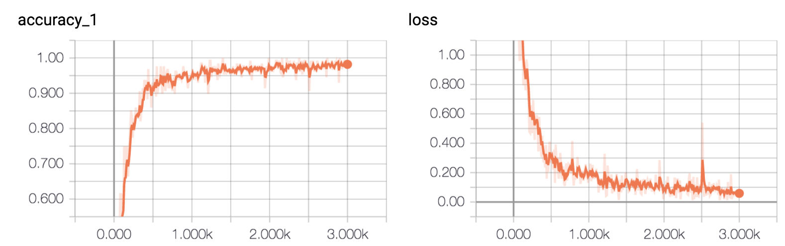

# Text Classification with CNN and RNN

使用卷积神经网络以及循环神经网络进行中文文本分类

CNN做句子分类的论文可以参看: [Convolutional Neural Networks for Sentence Classification](https://arxiv.org/abs/1408.5882)

还可以去读dennybritz大牛的博客：[Implementing a CNN for Text Classification in TensorFlow](http://www.wildml.com/2015/12/implementing-a-cnn-for-text-classification-in-tensorflow/)

以及字符级CNN的论文：[Character-level Convolutional Networks for Text Classification](https://arxiv.org/abs/1509.01626)

本文是基于TensorFlow在中文数据集上的简化实现，使用了字符级CNN和RNN对中文文本进行分类，达到了较好的效果。

文中所使用的Conv1D与论文中有些不同，详细参考官方文档：[tf.nn.conv1d](https://www.tensorflow.org/api_docs/python/tf/nn/conv1d)

## 环境

- Python 2/3 (感谢[howie.hu](https://github.com/howie6879)调试Python2环境)
- TensorFlow 1.3以上
- numpy
- scikit-learn
- scipy

## 数据集

2分类，在collection中，分别是pos：3303；neg：2202

类别如下：

```
利好，利空
```

数据集都是我一个个看下来收集的数据，真的耗时耗力还要准确，唯有吧中性的当作第三类，考虑我要的结论是否有利空而为之；
加之类多会导致误差增大，故而做二分类

数据集划分如下：

- 训练集: 0.75*5000
- 测试集: 0.25*5000
- 验证集: 没做，后面再说


- news_train.txt: 训练集
- news_test.txt: 测试集

## 预处理

`data/cnews_loader.py`为数据的预处理文件,本来是好坏样本两个文件

- `read_file()`: 读取文件数据;
- `build_vocab()`: 构建词汇表，使用字符级的表示，这一函数会将词汇表存储下来，避免每一次重复处理;
- `read_vocab()`: 读取上一步存储的词汇表，转换为`{词：id}`表示;
- `read_category()`: 将分类目录固定，转换为`{类别: id}`表示;
- `to_words()`: 将一条由id表示的数据重新转换为文字;
- `preocess_file()`: 将数据集从文字转换为固定长度的id序列表示;
- `batch_iter()`: 为神经网络的训练准备经过shuffle的批次的数据。

经过数据预处理，数据的格式如下：

| Data | Shape | Data | Shape |
| :---------- | :---------- | :---------- | :---------- |
| x_train | [3500, 600] | y_train | [3500, 2] |
| x_val | [1500, 600] | y_val | [1500, 2] |

## CNN卷积神经网络

### 配置项

CNN可配置的参数如下所示，在`cnn_model.py`中。

```python
class TCNNConfig(object):
    """CNN配置参数"""

    embedding_dim = 64      # 词向量维度----可以改32，训练次数可以多一点
    seq_length = 600        # 序列长度
    num_classes = 10        # 类别数
    num_filters = 128        # 卷积核数目
    kernel_size = 5         # 卷积核尺寸
    vocab_size = 1000       # 词汇表达小

    hidden_dim = 128        # 全连接层神经元

    dropout_keep_prob = 0.5 # dropout保留比例
    learning_rate = 1e-3    # 学习率

    batch_size = 64         # 每批训练大小
    num_epochs = 10         # 总迭代轮次

    print_per_batch = 100    # 每多少轮输出一次结果
    save_per_batch = 10      # 每多少轮存入tensorboard
```

### CNN模型

具体参看`cnn_model.py`的实现。

大致结构如下：


### 训练与验证

运行 `python run_cnn.py train`，可以开始训练。

> 若之前进行过训练，请把tensorboard/textcnn删除，避免TensorBoard多次训练结果重叠。

```
——————————————————————————————————————————————
Configuring CNN model...
Configuring TensorBoard and Saver...
Loading training and validation data...
Time usage: 0:00:14
Training and evaluating...
Epoch: 1
Iter:      0, Train Loss:   0.69, Train Acc:  56.25%, Val Loss:   0.69, Val Acc:  54.31%, Time: 0:00:08 *
Epoch: 2
Iter:    100, Train Loss:  0.074, Train Acc:  98.44%, Val Loss:   0.15, Val Acc:  94.58%, Time: 0:02:55 *
Epoch: 3
Epoch: 4
Iter:    200, Train Loss:  0.013, Train Acc: 100.00%, Val Loss:   0.12, Val Acc:  96.06%, Time: 0:05:41 *
Epoch: 5
Epoch: 6
Iter:    300, Train Loss:  0.008, Train Acc: 100.00%, Val Loss:   0.13, Val Acc:  95.81%, Time: 0:08:26
Epoch: 7
Epoch: 8
Iter:    400, Train Loss: 0.00071, Train Acc: 100.00%, Val Loss:   0.15, Val Acc:  95.97%, Time: 0:11:14
Epoch: 9
Iter:    500, Train Loss: 0.0007, Train Acc: 100.00%, Val Loss:   0.16, Val Acc:  95.97%, Time: 0:14:03
Epoch: 10

10次全部你迭代完毕，没去标点，batch_size是64，保留词频最高1000的词，
在验证集上的最佳效果为96.06%，且只经过了3轮迭代就已经停止。


测试的方法和验证的一样都用的evaluate(session....),后面再说，先要尝试其他参数和模型
————————————————————————————————————————————————————————

以下也是cnn，去了标点符号后的news_vocab_nopunc,其他不变
Configuring CNN model...
Configuring TensorBoard and Saver...
Loading training and validation data...
2018-05-05 16:35:35.981246: I C:\tf_jenkins\home\workspace\rel-win\M\windows\PY\35\tensorflow\core\platform\cpu_feature_guard.cc:137] Your CPU supports instructions that this TensorFlow binary was not compiled to use: AVX AVX2
Time usage: 0:00:01
Training and evaluating...
Epoch: 1
Iter:      0, Train Loss:   0.69, Train Acc:  53.12%, Val Loss:   0.69, Val Acc:  54.15%, Time: 0:00:06 *
Epoch: 2
Iter:    100, Train Loss:  0.081, Train Acc:  96.88%, Val Loss:   0.16, Val Acc:  93.84%, Time: 0:03:08 *
Epoch: 3
Epoch: 4
Iter:    200, Train Loss:  0.017, Train Acc: 100.00%, Val Loss:   0.13, Val Acc:  95.32%, Time: 0:05:58 *
Epoch: 5
Epoch: 6
Iter:    300, Train Loss:  0.021, Train Acc:  98.44%, Val Loss:   0.14, Val Acc:  94.99%, Time: 0:08:47
Epoch: 7
Epoch: 8
Iter:    400, Train Loss: 0.0022, Train Acc: 100.00%, Val Loss:   0.14, Val Acc:  95.73%, Time: 0:11:37 *
Epoch: 9
Iter:    500, Train Loss: 0.00028, Train Acc: 100.00%, Val Loss:   0.16, Val Acc:  95.81%, Time: 0:14:26 *
Epoch: 10

去了标点符号后的词频输入，验证集上最高是95.81，比不去标点要差，那么多迭代几次呢。。。。改epoch或batch_size

——————————————————————————————————————————————————————————
以下是把batch_size改成32的
Configuring CNN model...
Configuring TensorBoard and Saver...
Loading training and validation data...
2018-05-05 17:00:51.564007: I C:\tf_jenkins\home\workspace\rel-win\M\windows\PY\35\tensorflow\core\platform\cpu_feature_guard.cc:137] Your CPU supports instructions that this TensorFlow binary was not compiled to use: AVX AVX2
Time usage: 0:00:01
Training and evaluating...
Epoch: 1
Iter:      0, Train Loss:    0.7, Train Acc:  46.88%, Val Loss:   0.69, Val Acc:  54.40%, Time: 0:00:05 *
Iter:    100, Train Loss:   0.15, Train Acc:  90.62%, Val Loss:   0.23, Val Acc:  91.29%, Time: 0:01:32 *
Epoch: 2
Iter:    200, Train Loss:   0.18, Train Acc:  93.75%, Val Loss:   0.14, Val Acc:  94.74%, Time: 0:03:01 *
Epoch: 3
Iter:    300, Train Loss:   0.19, Train Acc:  90.62%, Val Loss:   0.14, Val Acc:  95.40%, Time: 0:04:30 *
Epoch: 4
Iter:    400, Train Loss:  0.032, Train Acc:  96.88%, Val Loss:   0.13, Val Acc:  95.89%, Time: 0:05:59 *
Epoch: 5
Iter:    500, Train Loss: 0.0099, Train Acc: 100.00%, Val Loss:   0.14, Val Acc:  95.89%, Time: 0:07:29
Epoch: 6
Iter:    600, Train Loss: 0.0014, Train Acc: 100.00%, Val Loss:   0.14, Val Acc:  95.73%, Time: 0:09:00
Epoch: 7
Iter:    700, Train Loss: 0.00059, Train Acc: 100.00%, Val Loss:   0.15, Val Acc:  95.07%, Time: 0:10:28
Epoch: 8
Iter:    800, Train Loss: 0.0011, Train Acc: 100.00%, Val Loss:   0.16, Val Acc:  95.81%, Time: 0:11:56
Iter:    900, Train Loss: 0.00029, Train Acc: 100.00%, Val Loss:   0.16, Val Acc:  95.40%, Time: 0:13:26
Epoch: 9
Iter:   1000, Train Loss: 0.00066, Train Acc: 100.00%, Val Loss:   0.17, Val Acc:  95.97%, Time: 0:14:56 *
Epoch: 10
Iter:   1100, Train Loss: 0.00014, Train Acc: 100.00%, Val Loss:   0.18, Val Acc:  96.06%, Time: 0:16:25 *

验证集最高还是96.06，同checkpoints的模型（第一个）

————————————————————————————————————————————————————————

以下是vocab不去标点，只改了batch_size的checkpoint_32模型，然后看看增加epoch有没有用
Configuring CNN model...
Configuring TensorBoard and Saver...
Loading training and validation data...
Time usage: 0:00:00
2018-05-05 17:22:40.424876: I C:\tf_jenkins\home\workspace\rel-win\M\windows\PY\35\tensorflow\core\platform\cpu_feature_guard.cc:137] Your CPU supports instructions that this TensorFlow binary was not compiled to use: AVX AVX2
Training and evaluating...
Epoch: 1
Iter:      0, Train Loss:   0.67, Train Acc:  62.50%, Val Loss:   0.69, Val Acc:  54.31%, Time: 0:00:06 *
Iter:    100, Train Loss:   0.25, Train Acc:  93.75%, Val Loss:   0.21, Val Acc:  92.77%, Time: 0:01:38 *
Epoch: 2
Iter:    200, Train Loss:   0.12, Train Acc:  93.75%, Val Loss:   0.14, Val Acc:  94.74%, Time: 0:03:08 *
Epoch: 3
Iter:    300, Train Loss:   0.02, Train Acc: 100.00%, Val Loss:   0.12, Val Acc:  95.89%, Time: 0:04:36 *
Epoch: 4
Iter:    400, Train Loss: 0.0068, Train Acc: 100.00%, Val Loss:   0.14, Val Acc:  96.30%, Time: 0:06:06 *
Epoch: 5
Iter:    500, Train Loss:  0.012, Train Acc: 100.00%, Val Loss:   0.16, Val Acc:  95.23%, Time: 0:07:49
Epoch: 6
Iter:    600, Train Loss: 0.00065, Train Acc: 100.00%, Val Loss:   0.15, Val Acc:  95.89%, Time: 0:10:25
Epoch: 7
Iter:    700, Train Loss: 0.0021, Train Acc: 100.00%, Val Loss:   0.17, Val Acc:  95.48%, Time: 0:12:59
Epoch: 8
Iter:    800, Train Loss: 0.00028, Train Acc: 100.00%, Val Loss:   0.18, Val Acc:  95.56%, Time: 0:15:34
Iter:    900, Train Loss: 0.00034, Train Acc: 100.00%, Val Loss:   0.21, Val Acc:  95.56%, Time: 0:18:08
Epoch: 9
Iter:   1000, Train Loss: 0.00037, Train Acc: 100.00%, Val Loss:   0.19, Val Acc:  95.56%, Time: 0:20:45
Epoch: 10
Iter:   1100, Train Loss: 0.00026, Train Acc: 100.00%, Val Loss:    0.2, Val Acc:  95.65%, Time: 0:23:21

验证集最高到96.30，说明数据集小，减小batch_size是会提升精度的

————————————————————————————————————————————————————————————
以下是vocab不去标点，减小batch_size到32，增大epoch到20次
Configuring CNN model...
Configuring TensorBoard and Saver...
Loading training and validation data...
2018-05-05 17:30:11.172847: I C:\tf_jenkins\home\workspace\rel-win\M\windows\PY\35\tensorflow\core\platform\cpu_feature_guard.cc:137] Your CPU supports instructions that this TensorFlow binary was not compiled to use: AVX AVX2
Time usage: 0:00:01
Training and evaluating...
Epoch: 1
Iter:      0, Train Loss:    0.7, Train Acc:  46.88%, Val Loss:    0.7, Val Acc:  45.19%, Time: 0:00:10 *
Iter:    100, Train Loss:   0.15, Train Acc:  96.88%, Val Loss:    0.2, Val Acc:  93.02%, Time: 0:02:48 *
Epoch: 2
Iter:    200, Train Loss:   0.16, Train Acc:  90.62%, Val Loss:   0.13, Val Acc:  94.82%, Time: 0:05:24 *
Epoch: 3
Iter:    300, Train Loss:  0.022, Train Acc: 100.00%, Val Loss:   0.12, Val Acc:  96.06%, Time: 0:08:00 *
Epoch: 4
Iter:    400, Train Loss: 0.0075, Train Acc: 100.00%, Val Loss:   0.14, Val Acc:  95.23%, Time: 0:10:34
Epoch: 5
Iter:    500, Train Loss: 0.0033, Train Acc: 100.00%, Val Loss:   0.15, Val Acc:  95.81%, Time: 0:13:10
Epoch: 6
Iter:    600, Train Loss: 0.0029, Train Acc: 100.00%, Val Loss:   0.14, Val Acc:  96.47%, Time: 0:15:47 *
Epoch: 7
Iter:    700, Train Loss: 0.0011, Train Acc: 100.00%, Val Loss:   0.17, Val Acc:  96.14%, Time: 0:17:42
Epoch: 8
Iter:    800, Train Loss: 0.0012, Train Acc: 100.00%, Val Loss:   0.17, Val Acc:  95.89%, Time: 0:19:09
Iter:    900, Train Loss: 0.0003, Train Acc: 100.00%, Val Loss:   0.17, Val Acc:  96.47%, Time: 0:20:39 *
Epoch: 9
Iter:   1000, Train Loss: 0.00031, Train Acc: 100.00%, Val Loss:   0.18, Val Acc:  96.55%, Time: 0:22:08 *
Epoch: 10
Iter:   1100, Train Loss: 0.0002, Train Acc: 100.00%, Val Loss:   0.18, Val Acc:  96.55%, Time: 0:23:36
Epoch: 11
Iter:   1200, Train Loss: 0.00012, Train Acc: 100.00%, Val Loss:   0.19, Val Acc:  96.55%, Time: 0:25:04
Epoch: 12
Iter:   1300, Train Loss: 0.00011, Train Acc: 100.00%, Val Loss:    0.2, Val Acc:  96.47%, Time: 0:26:33
Epoch: 13
Iter:   1400, Train Loss: 1.4e-05, Train Acc: 100.00%, Val Loss:    0.2, Val Acc:  96.55%, Time: 0:28:01
Epoch: 14
Iter:   1500, Train Loss: 2.5e-05, Train Acc: 100.00%, Val Loss:    0.2, Val Acc:  96.63%, Time: 0:29:29 *
Epoch: 15
Iter:   1600, Train Loss: 4.9e-05, Train Acc: 100.00%, Val Loss:    0.2, Val Acc:  96.22%, Time: 0:30:58
Iter:   1700, Train Loss: 0.0002, Train Acc: 100.00%, Val Loss:   0.21, Val Acc:  96.55%, Time: 0:32:26
Epoch: 16
Iter:   1800, Train Loss:  4e-05, Train Acc: 100.00%, Val Loss:   0.21, Val Acc:  96.47%, Time: 0:33:55
Epoch: 17
Iter:   1900, Train Loss: 3.2e-05, Train Acc: 100.00%, Val Loss:   0.21, Val Acc:  96.55%, Time: 0:35:23
Epoch: 18
Iter:   2000, Train Loss: 9.4e-06, Train Acc: 100.00%, Val Loss:   0.21, Val Acc:  96.47%, Time: 0:36:51
Epoch: 19
Iter:   2100, Train Loss: 1.5e-05, Train Acc: 100.00%, Val Loss:   0.22, Val Acc:  96.55%, Time: 0:38:20
Epoch: 20
Iter:   2200, Train Loss: 9.3e-06, Train Acc: 100.00%, Val Loss:   0.22, Val Acc:  96.55%, Time: 0:39:48


精度到达96.63，多次尝试，根据多次调参，cnn训练模型暂时用checkpoint_32_20！
尚未尝试的有，batch_size减小到16，epoch增加到30，因为样本多数为短文本，所以embeding也可作减小处理到32。
*********************************************************************************************************


## RNN循环神经网络

### 配置项

RNN可配置的参数如下所示，在`rnn_model.py`中。

```python
class TRNNConfig(object):
    """RNN配置参数"""

    # 模型参数
    embedding_dim = 64      # 词向量维度
    seq_length = 600        # 序列长度
    num_classes = 2        # 类别数
    vocab_size = 5000       # 词汇表达小

    num_layers= 2           # 隐藏层层数
    hidden_dim = 128        # 隐藏层神经元
    rnn = 'gru'             # lstm 或 gru

    dropout_keep_prob = 0.8 # dropout保留比例
    learning_rate = 1e-3    # 学习率

    batch_size = 32         # 每批训练大小
    num_epochs = 10          # 总迭代轮次

    print_per_batch = 100    # 每多少轮输出一次结果
    save_per_batch = 10      # 每多少轮存入tensorboard
```

### RNN模型

具体参看`rnn_model.py`的实现。

大致结构如下：


### 训练与验证

> 这部分的代码与 run_cnn.py极为相似，只需要将模型和部分目录稍微修改。

运行 `python run_rnn.py train`，可以开始训练。

> 若之前进行过训练，请把tensorboard/textrnn删除，避免TensorBoard多次训练结果重叠。

```
——————————————————————————————————————————————————————
以下我直接用20次epoch，32的batch_size，含标点vocab的训练结果

Configuring RNN model...
Configuring TensorBoard and Saver...
Loading training and validation data...
Time usage: 0:00:00
2018-05-05 19:54:49.328587: I C:\tf_jenkins\home\workspace\rel-win\M\windows\PY\35\tensorflow\core\platform\cpu_feature_guard.cc:137] Your CPU supports instructions that this TensorFlow binary was not compiled to use: AVX AVX2
Training and evaluating...
Epoch: 1
Iter:      0, Train Loss:   0.69, Train Acc:  62.50%, Val Loss:   0.69, Val Acc:  51.85%, Time: 0:00:23 *
Iter:    100, Train Loss:   0.15, Train Acc:  93.75%, Val Loss:   0.26, Val Acc:  89.98%, Time: 0:05:14 *
Epoch: 2
Iter:    200, Train Loss:   0.19, Train Acc:  93.75%, Val Loss:   0.25, Val Acc:  90.22%, Time: 0:09:39 *
Epoch: 3
Iter:    300, Train Loss:  0.099, Train Acc: 100.00%, Val Loss:   0.28, Val Acc:  89.32%, Time: 0:13:51
Epoch: 4
Iter:    400, Train Loss:    0.3, Train Acc:  93.75%, Val Loss:   0.22, Val Acc:  93.18%, Time: 0:18:03 *
Epoch: 5
Iter:    500, Train Loss:   0.14, Train Acc:  93.75%, Val Loss:   0.23, Val Acc:  92.19%, Time: 0:22:14
Epoch: 6
Iter:    600, Train Loss:  0.053, Train Acc:  96.88%, Val Loss:   0.22, Val Acc:  93.18%, Time: 0:26:27 *
Epoch: 7
Iter:    700, Train Loss:  0.018, Train Acc: 100.00%, Val Loss:    0.2, Val Acc:  93.67%, Time: 0:30:42 *
Epoch: 8
Iter:    800, Train Loss:  0.076, Train Acc: 100.00%, Val Loss:   0.22, Val Acc:  92.60%, Time: 0:34:53
Iter:    900, Train Loss:  0.023, Train Acc: 100.00%, Val Loss:   0.17, Val Acc:  94.17%, Time: 0:39:05 *
Epoch: 9
Iter:   1000, Train Loss:   0.14, Train Acc:  93.75%, Val Loss:   0.25, Val Acc:  93.02%, Time: 0:43:29
Epoch: 10
Iter:   1100, Train Loss: 0.0031, Train Acc: 100.00%, Val Loss:   0.27, Val Acc:  94.25%, Time: 0:47:41 *
Epoch: 11
Iter:   1200, Train Loss: 0.0025, Train Acc: 100.00%, Val Loss:   0.26, Val Acc:  93.59%, Time: 0:51:52
Epoch: 12
Iter:   1300, Train Loss: 0.00019, Train Acc: 100.00%, Val Loss:   0.31, Val Acc:  94.82%, Time: 0:57:01 *
Epoch: 13
Iter:   1400, Train Loss:   0.13, Train Acc:  96.88%, Val Loss:   0.26, Val Acc:  94.00%, Time: 1:02:57
Epoch: 14
Iter:   1500, Train Loss: 0.0086, Train Acc: 100.00%, Val Loss:   0.24, Val Acc:  94.91%, Time: 1:09:02 *
Epoch: 15
Iter:   1600, Train Loss: 0.0016, Train Acc: 100.00%, Val Loss:   0.23, Val Acc:  94.41%, Time: 1:14:59
Iter:   1700, Train Loss:  0.087, Train Acc:  96.88%, Val Loss:   0.28, Val Acc:  94.58%, Time: 1:20:56
Epoch: 16
Iter:   1800, Train Loss: 0.00049, Train Acc: 100.00%, Val Loss:   0.38, Val Acc:  94.66%, Time: 1:26:55
Epoch: 17
Iter:   1900, Train Loss:  0.061, Train Acc:  96.88%, Val Loss:   0.39, Val Acc:  94.49%, Time: 1:33:00
Epoch: 18
Iter:   2000, Train Loss: 0.0046, Train Acc: 100.00%, Val Loss:   0.37, Val Acc:  94.58%, Time: 1:39:02
Epoch: 19
Iter:   2100, Train Loss: 0.0025, Train Acc: 100.00%, Val Loss:   0.35, Val Acc:  94.58%, Time: 1:45:08
Epoch: 20
Iter:   2200, Train Loss: 7.8e-05, Train Acc: 100.00%, Val Loss:   0.37, Val Acc:  94.99%, Time: 1:51:23 *

在最后一轮迭代，精度高达94.99，还能再增加迭代次数
——————————————————————————————————————————————————————
以下我直接用20次epoch，32的batch_size，不含标点vocab的训练结果

Configuring RNN model...
Configuring TensorBoard and Saver...
Loading training and validation data...
2018-05-05 20:49:47.519929: I C:\tf_jenkins\home\workspace\rel-win\M\windows\PY\35\tensorflow\core\platform\cpu_feature_guard.cc:137] Your CPU supports instructions that this TensorFlow binary was not compiled to use: AVX AVX2
Time usage: 0:00:02
Training and evaluating...
Epoch: 1
Iter:      0, Train Loss:   0.69, Train Acc:  56.25%, Val Loss:   0.69, Val Acc:  49.55%, Time: 0:00:42 *
Iter:    100, Train Loss:   0.21, Train Acc:  96.88%, Val Loss:   0.24, Val Acc:  90.88%, Time: 0:06:51 *
Epoch: 2
Iter:    200, Train Loss:   0.25, Train Acc:  90.62%, Val Loss:   0.25, Val Acc:  91.04%, Time: 0:13:05 *
Epoch: 3
Iter:    300, Train Loss:  0.076, Train Acc:  96.88%, Val Loss:   0.19, Val Acc:  94.00%, Time: 0:19:09 *
Epoch: 4
Iter:    400, Train Loss:  0.081, Train Acc:  96.88%, Val Loss:    0.2, Val Acc:  94.74%, Time: 0:25:22 *
Epoch: 5
Iter:    500, Train Loss:   0.11, Train Acc:  96.88%, Val Loss:   0.15, Val Acc:  95.65%, Time: 0:31:31 *
Epoch: 6
Iter:    600, Train Loss:  0.012, Train Acc: 100.00%, Val Loss:    0.2, Val Acc:  93.84%, Time: 0:37:34
Epoch: 7
Iter:    700, Train Loss:  0.024, Train Acc: 100.00%, Val Loss:   0.26, Val Acc:  94.25%, Time: 0:43:40
Epoch: 8
Iter:    800, Train Loss:  0.046, Train Acc:  96.88%, Val Loss:   0.21, Val Acc:  93.26%, Time: 0:49:42
Iter:    900, Train Loss:  0.036, Train Acc: 100.00%, Val Loss:   0.17, Val Acc:  95.07%, Time: 0:55:46
Epoch: 9
Iter:   1000, Train Loss: 0.0051, Train Acc: 100.00%, Val Loss:   0.24, Val Acc:  95.23%, Time: 1:01:12
Epoch: 10
Iter:   1100, Train Loss:  0.011, Train Acc: 100.00%, Val Loss:   0.21, Val Acc:  94.66%, Time: 1:04:16
Epoch: 11
Iter:   1200, Train Loss: 0.0037, Train Acc: 100.00%, Val Loss:   0.23, Val Acc:  94.74%, Time: 1:07:20
Epoch: 12
Iter:   1300, Train Loss: 0.0022, Train Acc: 100.00%, Val Loss:    0.3, Val Acc:  94.99%, Time: 1:10:24
Epoch: 13
Iter:   1400, Train Loss:  0.035, Train Acc:  96.88%, Val Loss:   0.22, Val Acc:  94.99%, Time: 1:13:28
Epoch: 14
Iter:   1500, Train Loss:  0.004, Train Acc: 100.00%, Val Loss:    0.2, Val Acc:  96.22%, Time: 1:16:33 *
Epoch: 15
Iter:   1600, Train Loss: 0.00044, Train Acc: 100.00%, Val Loss:   0.27, Val Acc:  95.56%, Time: 1:19:37
Iter:   1700, Train Loss: 0.0056, Train Acc: 100.00%, Val Loss:   0.31, Val Acc:  94.99%, Time: 1:22:41
Epoch: 16
Iter:   1800, Train Loss: 2.6e-05, Train Acc: 100.00%, Val Loss:   0.34, Val Acc:  95.89%, Time: 1:25:45
Epoch: 17
Iter:   1900, Train Loss: 0.0011, Train Acc: 100.00%, Val Loss:   0.24, Val Acc:  95.65%, Time: 1:28:49
Epoch: 18
Iter:   2000, Train Loss: 0.00033, Train Acc: 100.00%, Val Loss:   0.29, Val Acc:  95.65%, Time: 1:31:53
Epoch: 19
Iter:   2100, Train Loss: 1.8e-05, Train Acc: 100.00%, Val Loss:   0.31, Val Acc:  95.73%, Time: 1:34:57
Epoch: 20
Iter:   2200, Train Loss: 0.0015, Train Acc: 100.00%, Val Loss:   0.23, Val Acc:  95.48%, Time: 1:38:01
在验证集上的最佳效果为96.22%，经过了14轮迭代停止，速度相比CNN慢很多。


结论是，rnn训练速度极慢，不用标点vocab集比含标点vocab集的训练结果要好很多，
但结果还是96.63（vocab不去标点，batch_size到32，epoch到20次）的cnn更高（训练模型暂时用checkpoint_32_20）

————————————————————————————————————————————————


等其他模型训练完在做下面的


准确率和误差如图所示：




### 测试

运行 `python run_rnn.py test` 在测试集上进行测试。

```
Testing...
Test Loss:   0.21, Test Acc:  94.22%
Precision, Recall and F1-Score...
             precision    recall  f1-score   support

         体育       0.99      0.99      0.99      1000
         财经       0.91      0.99      0.95      1000
         房产       1.00      1.00      1.00      1000
         家居       0.97      0.73      0.83      1000
         教育       0.91      0.92      0.91      1000
         科技       0.93      0.96      0.94      1000
         时尚       0.89      0.97      0.93      1000
         时政       0.93      0.93      0.93      1000
         游戏       0.95      0.97      0.96      1000
         娱乐       0.97      0.96      0.97      1000

avg / total       0.94      0.94      0.94     10000

Confusion Matrix...
[[988   0   0   0   4   0   2   0   5   1]
 [  0 990   1   1   1   1   0   6   0   0]
 [  0   2 996   1   1   0   0   0   0   0]
 [  2  71   1 731  51  20  88  28   3   5]
 [  1   3   0   7 918  23   4  31   9   4]
 [  1   3   0   3   0 964   3   5  21   0]
 [  1   0   1   7   1   3 972   0   6   9]
 [  0  16   0   0  22  26   0 931   2   3]
 [  2   3   0   0   2   2  12   0 972   7]
 [  0   3   1   1   7   3  11   5   9 960]]
Time usage: 0:00:33
```

在测试集上的准确率达到了94.22%，且各类的precision, recall和f1-score，除了家居这一类别，都超过了0.9。

从混淆矩阵可以看出分类效果非常优秀。

对比两个模型，可见RNN除了在家居分类的表现不是很理想，其他几个类别较CNN差别不大。

还可以通过进一步的调节参数，来达到更好的效果。
